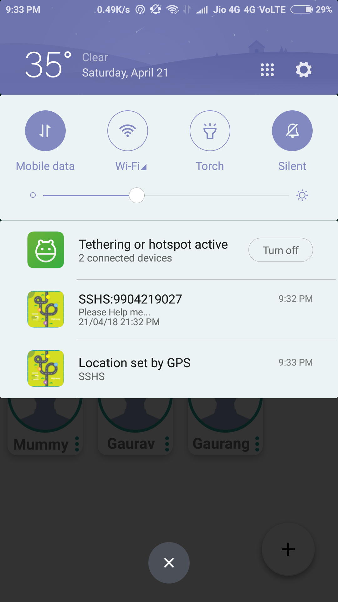
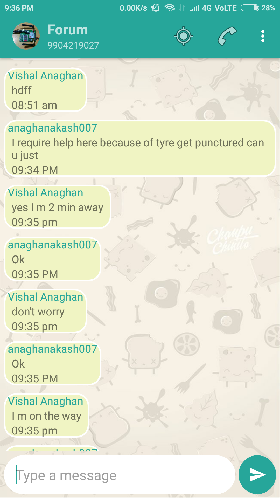
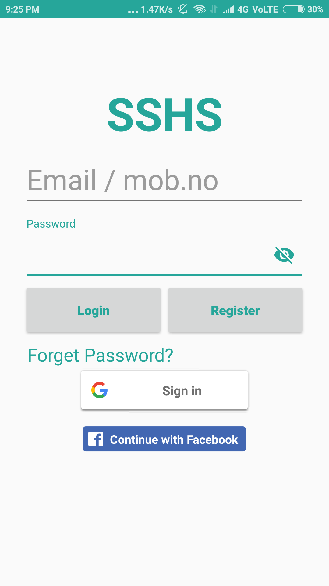
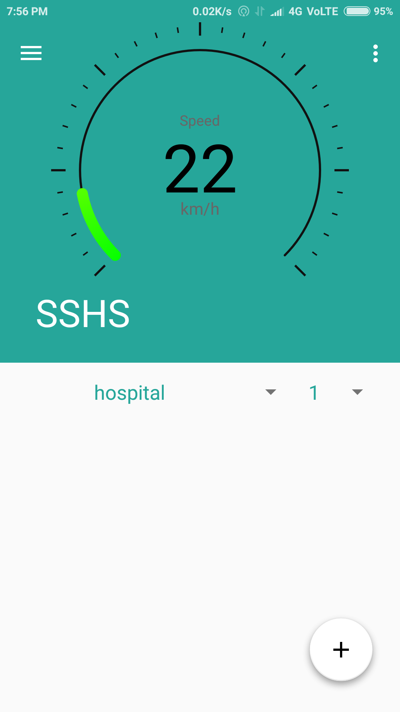
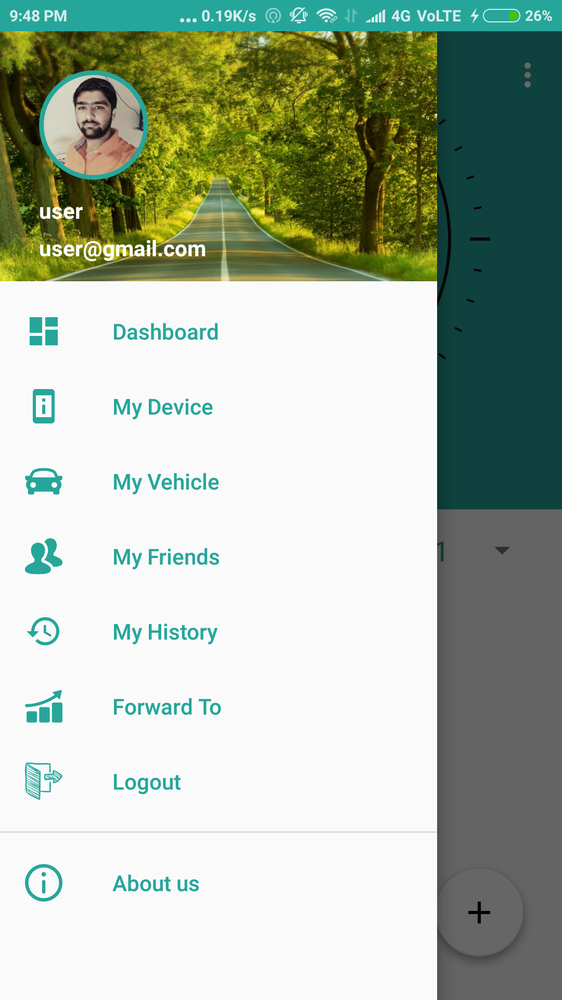
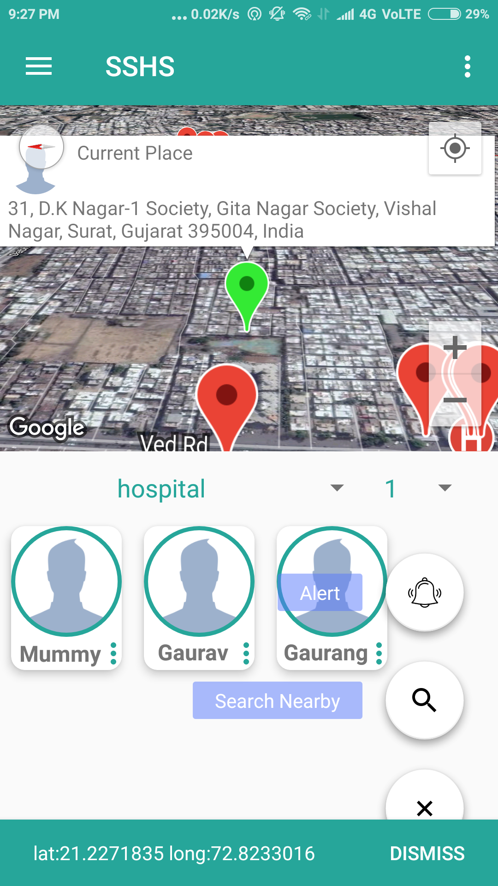
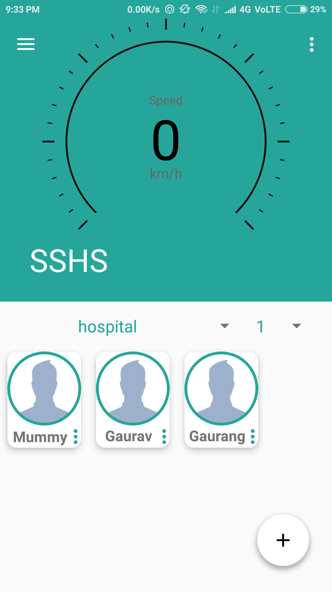

# safe-and-smart-highway

* this project is about how to provide safety to the user on highway by providing information as well as help from nearby help center on highway
* automatic emergency broadcast message service can be on/off from app setting.
* anyone from phonebook contact list can be added in friends list to contact in case of emergency on highway.
* google or facebook or email login options are available to the user, other than email and phone number.
* All relatives added in a friends/relatives list get notified by push notification in case of any kind of emergency on the highway, when one opens a push notification then common whatsapp group chat opens where all friends/relatives can see the live location of user and status of the issue till problem not get flagged as solved by help requestor.
* user can see last seen as well as last location of his/her friend in home screen.
* An alert remains active even after closing an application and user can mark a problem as solved any time after creating an alert.

<table rows='3' cols='3'>

<tr>
<td></td><td>  
<td></td>
</tr>
<tr><td></td>
<td></td>
<td>
</td></tr>

<tr><td></td><td>
<td></td></tr>
</table>
